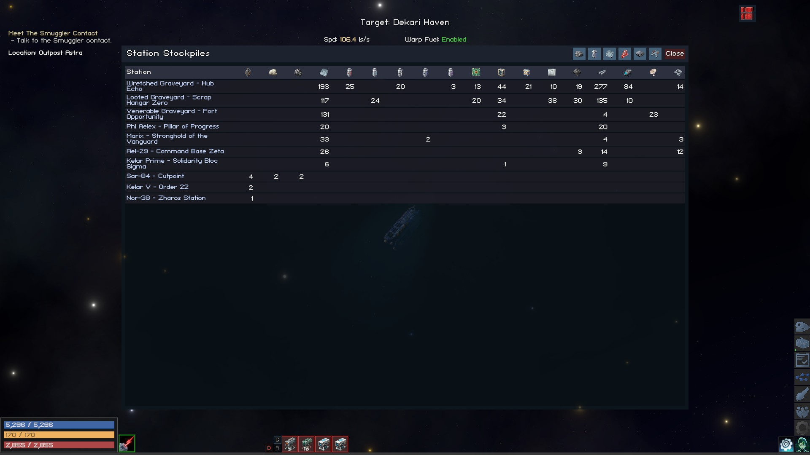

# VGStockpile — Galaxy-wide station stockpile overview for Vanguard Galaxy

A BepInEx 5 plugin that adds a HUD button (top-right) which opens a single window showing every station's stored materials in one grid. Stations as rows, materials as columns. Pure observer — VGStockpile never modifies a save file.



## Features

- **Galaxy-wide grid.** Every station with ≥1 stored material appears as a row; every material that exists across visible stations gets a column.
- **Vanilla "Sort by Type" column order.** Columns cluster the same way the cargo inventory's *Sort by Type* button orders items — `(itemCategory, gameplayType, name)`, lifted verbatim from the game's `Inventory.SortByCategory`.
- **Category filters.** Six toggle buttons in the header — Ores, Refined Canisters, Refined Products, Crystals, Trade Goods, Salvage. Click to hide / show. State persists across sessions.
- **Vanilla item tooltips on hover.** Header icons and quantity cells use `ItemTooltipSource`, the same tooltip component vanilla inventory slots use.
- **Click a station label to "Locate"** — opens the galaxy map and focuses the station, mirroring the mission UI's Locate button (calls `SidePanel.OpenMapAndFocusPoi`).
- **Live read on open.** No persisted sidecar, no Harmony patches that mutate behavior. Reopening the window refreshes data.

## Install

1. Install BepInEx 5.x in your Vanguard Galaxy folder.
2. Drop the `VGStockpile/` folder from the release zip into `BepInEx/plugins/`.
3. Launch the game.

## Configuration

`BepInEx/config/vgstockpile.cfg` exposes:

| Key | Default | Purpose |
|---|---|---|
| `UI.ActiveCategories` | `RefinedCanister,RefinedGoods,Crystal,TradeGoods,Salvage,Other` | Comma-separated list of visible categories. Toggling a filter button updates this. |
| `UI.IconRightPadding` / `UI.IconTopPadding` | `24` / `12` | HUD icon position from the top-right corner. |
| `UI.CloseWindowOnLocate` | `true` | Auto-close the window when a station label is clicked. |
| `Diagnostics.Verbose` | `false` | Per-station item dump and grid geometry log. |
| `Diagnostics.DumpIconsOnce` | `false` | Dumps every loaded `Sprite` to `BepInEx/cache/vgstockpile-icons/` (with a manifest) ~8s after game start, then flips back to false. Used for picking new icons. |

## Build (for contributors)

The repository ships as a sibling of the other Vanguard Galaxy plugins. Make sure `vanguard-galaxy-tts/VGTTS/lib/Assembly-CSharp.dll` exists (the publicized stub all sibling plugins compile against).

```sh
make build      # links libs, compiles VGStockpile.dll
make test       # 29 xUnit tests on the pure-logic layers
make deploy     # copies into <GAME_DIR>/BepInEx/plugins/VGStockpile/
```

`<GAME_DIR>` is hard-coded to a WSL Steam path in the Makefile — adjust locally for non-WSL setups, but don't commit the change.

## Architecture

Three internal areas:

- **`Data/`** — pure read side. `StationStorageReader` walks the galaxy POIs, reads each `SpaceStation.materialStorage`, returns immutable `StationStorageSnapshot` records. `MaterialCatalog` resolves `InventoryItemType` references and classifies materials into the `MaterialCategory` enum.
- **`UI/`** — UGUI rendering. `StorageGridBuilder` (pure, unit-tested) computes columns + sorted rows. `StationStorageWindow` and `StationStorageIcon` are the Unity-touching layer.
- **`Locate/`** — `IStationLocator` + production `StationLocator` that invokes vanilla's `SidePanel.OpenMapAndFocusPoi` coroutine via reflection (publicized stub vs runtime privacy).

29 tests cover the pure-logic units — `CompactNumber`, `MaterialCatalog` semantics, `StorageGridBuilder` sort/filter rules, and the click-to-locate handler. Unity-touching code (icon, window, reader, production locator) is verified manually in-game.

## License

MIT — see `LICENSE`.
